<h1> 2° PARCIAL PP - LA SCALONETA 2022 </h1>

***
<h3 id="indice">🧾 Índice</h3>
1) <a href="#objetivo">📈 Objetivo</a> <br>
2) <a href="#requerimientosExcluyentes">📍 Requerimientos excluyentes</a> <br>
3) <a href="#requerimientosPorFecha">🗓 Requerimientos por fecha</a> <br>
4) <a href="#profesores">👨🏼‍🎓 Profesores</a> <br>
5) <a href="#integrantes">👨‍👧‍👦 Integrantes</a> <br>
<!-- 6) <a href="#fechasActualizacionesEspecificas">✏️ Bitácora tareas específicas</a> <br> -->
6) <a href="#fechasActualizacionesGenerales">🖍 Bitácora tareas generales</a> <br>
7) <a href="#visualizacionProyecto">📲 Visualización del proyecto</a> <br>
8) <a href="#comandos">👨🏻‍💻 Comandos</a> <br>

***
<h3 id="integrantes">👨‍👧‍👦 Integrantes</h3>
<a href="https://github.com/ex0num">Gabriel Lopez Gasal</a> - <strong>Alpha</strong> <br>
<a href="https://github.com/valentinlaplume">Valentín Laplume</a> - <strong>Beta</strong> <br>
<a href="https://github.com/aletexis">Alejandra Escubilla</a> - <strong>Gamma</strong> <br>

***
<h3 id="fechasActualizacionesGenerales">🖍 Fechas de actualización / Bitácora de cambios general</h3>

<strong> 26/10/22 </strong> <br>
<label>- Se creó el proyecto. - Alpha</label> <br>
<br>
<strong> 27/10/22 </strong> <br>
<label>- Se diseñó el ícono - Alpha</label> <br>
<br>
<strong> 07/11/22 </strong> <br>
<label>- Se diseñó el splash estático y animado. - Alpha</label> <br>
<label>- Se diseñaron las animaciones de la splashscreeen. - Alpha</label> <br>
<label>- Se creó y diseñó el <strong>Alta de cliente (Anónimo y normal)</strong> - Alpha</label> <br>
<br>
<strong> 08/11/22 </strong> <br>
<label>- Se creó y diseñó el <strong>Alta de supervisor y dueño</strong> - Alpha</label> <br>
<label>- Se creó y diseñó el <strong>Alta de empleados</strong> - Alpha</label> <br>

<strong> 09/11/22 </strong> <br>
<label>- Se creó y diseñó el <strong>Alta de mesa</strong> - Alpha</label> <br>
<label>- Se creó y diseñó el menú de <strong>Aprobación/Rechazo de clientes</strong> - Alpha</label> <br>

<strong> 10/11/22 </strong> <br>
<label>- Nota importante: <br>
(El proyecto fue migrado, creado de 0 con amor y con mucha mucha paciencia, a la carpeta 'LA-SCALONETA-2022-SUB'). Fue refactorizado en su totalidad (internamente, no de forma visual), con implementaciones de Firebase mejores y más actuales (Sólo cambió Firebase Service y Auth Service). <br> 
El proyecto anterior casi no tenia <strong>reflejos de cambios en VIVO</strong>. Ahora sí. <strong>Todo cambio alguno en tiempo real impacta en el sistema instantaneamente</strong>. (Facilitando y permitiendo la realización del chat en vivo, manejo de estados de cliente, pedido, aceptación del cliente en el sistema).<br> 
En conclusión, una <strong> mejora casi primordial para que funcione el sistema. </strong> <br> Era necesario el cambio, e insostenible seguir utilizando métodos de Snapshop y no Subscribers. Tarde o temprano se iba a tener que cambiar esto... y mejor ahora que con 700 800 más líneas de código con el pasar de los días - Alpha</label> <br>

<strong> 11/11/22 </strong> <br>
<label>- Se creó y diseñó el menú de <strong>Asignación de mesas a clientes (anónimos y logeados)</strong> - Alpha</label> <br>

<strong> 12/11/22 </strong> <br>
<label>- Se creó y diseñó el de <strong>Alta de productos</strong> - Alpha</label> <br>
<label>- Se creó y diseñó el menú de <strong>Home cocinero y home bartender</strong> - Alpha</label> <br>
<label>- Se creó y diseñó la sección de <strong>Chat/consulta a los mozos</strong> - Alpha</label> <br>
<label>- Notas importantes: <br>
Todas los módulos de alta ya fueron finalizados. Fotos adjuntas. <br>
Actualmente en el recorrido número del 1 al 13. El proyecto se encuentra en el 6/13. <br> 
Los QRs de las mesas ya fueron adjuntos al readme. (Estos QRS son mas simples debido a que son generados 'on-live' en el mismo alta de la mesa. - Alpha</label> <br>

<strong> 13/11/22 </strong> <br>
<label>- Se creó y diseñó el <strong>Menú</strong> - Alpha</label> <br>
<label>- Se creó y diseñó la sección <strong>Realizar pedido</strong> - Alpha</label> <br>

<strong> 14/11/22 </strong> <br>
<label>- Se creó y diseñó la sección <strong>Pedidos esperando mozo</strong> - Alpha</label> <br>

<strong> 14/11/22 </strong> <br>
<label>- Se creó y diseñó la sección <strong>Pedidos del mozo esperando respuesta</strong> - Alpha</label> <br>
<label>- Se creó y diseñó el <strong>Home del pedido</strong> - Alpha</label> <br>

<strong> 15/11/22 </strong> <br>
<label>- Se creó y diseñó el  <strong>Home del bartender/cocinero</strong> - Alpha</label> <br>
<label>- Se creó y diseñó el de <strong>Pedidos del mozo esperando respuesta</strong> - Alpha</label> <br>

<strong> 16/11/22 </strong> <br>
<label>- Se creó y diseñó la sección de <strong>Propina QR-scan y generación de cuenta</strong> - Alpha</label> <br>
<label>- Se creó y diseñó la sección de <strong>Propina QR-scan y generación de cuenta</strong> - Alpha</label> <br>

***
<h3 id="visualizacionProyecto">📲 Visualización del proyecto</h3><br>

<h3>Ícono</h3>

<label> Nuestro restaurante, es de tipo <strong>urbano/juvenil, nocturno, con un "look and feel" moderno y alejado de la elegancia.</strong></label><br><br>
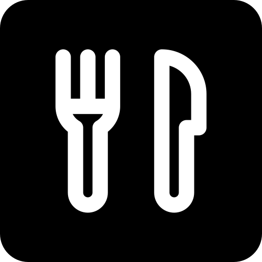
<br><br>

***
<h3>Login y registro</h3>

<strong> Pantalla de login y de registro </strong><br>
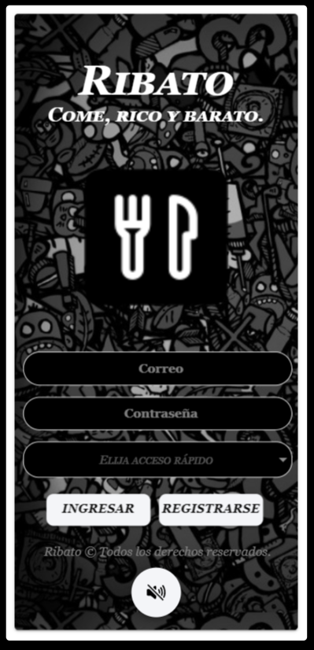
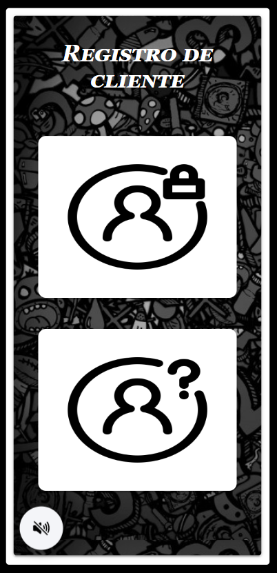<br>

***
<h3>Pantallas administrativas y de recorrido</h3>

<strong> Pantalla de asignación mesa y aprobación clientes.</strong><br>
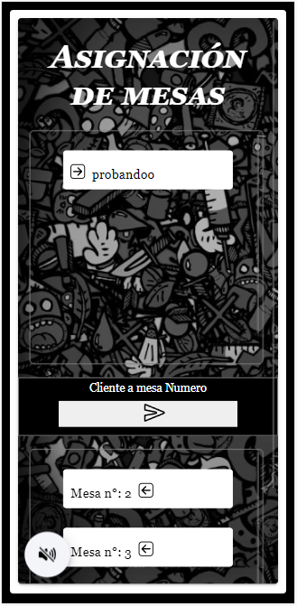
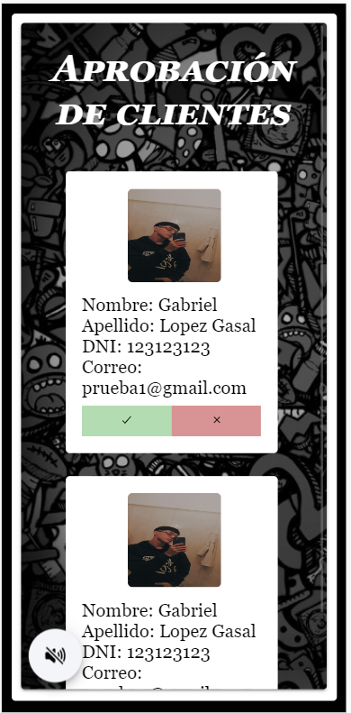<br>

<strong> Pantalla de esperando mesa y de bienvenida a la mesa</strong><br>

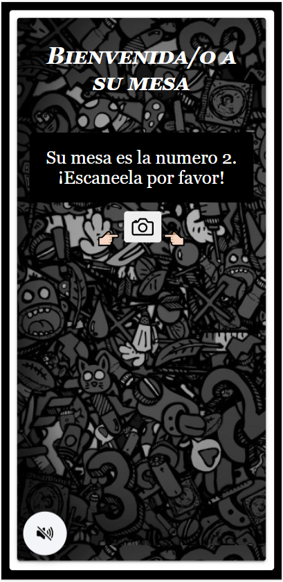<br>

<strong> QRs mesas (1,2,3) respectivamente</strong><br>
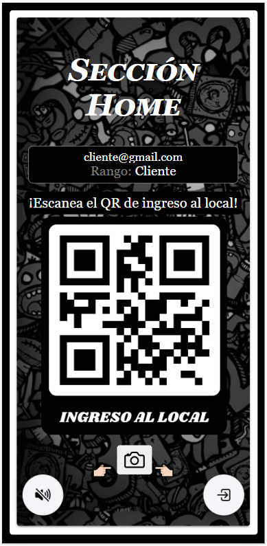<br>
<br><label>Mesa 1</label><br>
<br>
<br><label>Mesa 2</label><br>
<br>
<br><label>Mesa 3</label><br>
<br>

<strong> Pantalla de cliente rechazado y pendiente.</strong><br>
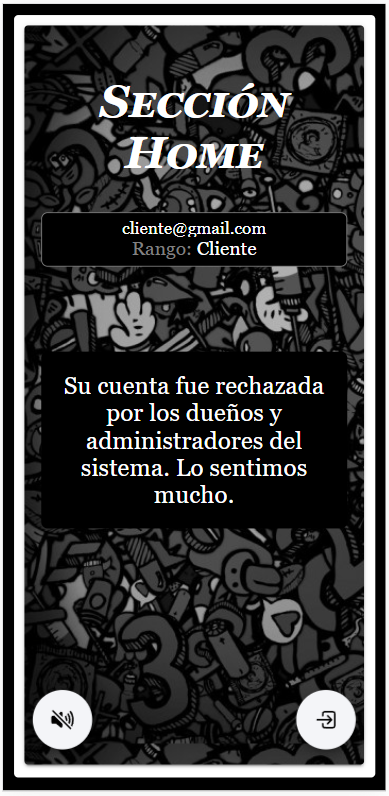
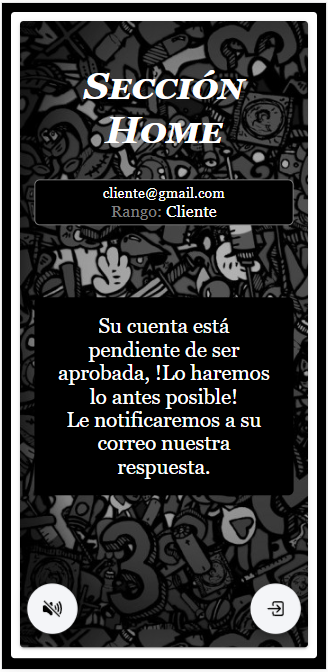<br>

***
<h3>Altas</h3>

<strong> Pantalla de alta cliente y anónimo.</strong><br>
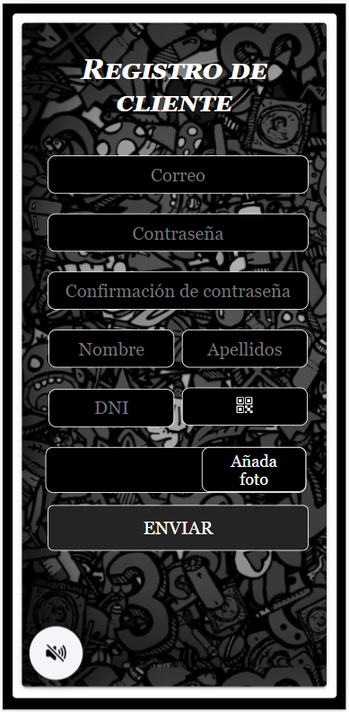
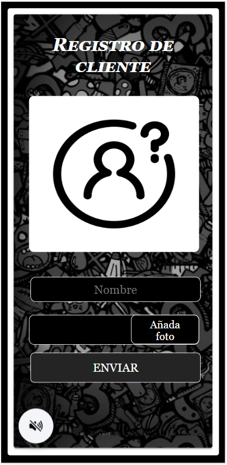<br>

<strong> Pantalla de alta (Supervisor/Dueño) y empleados.</strong><br>
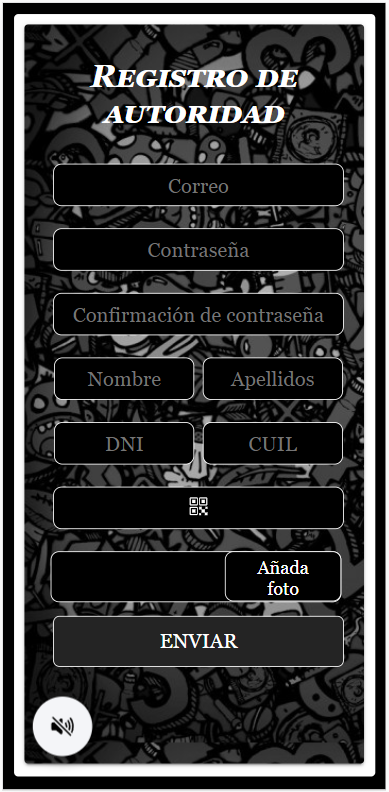
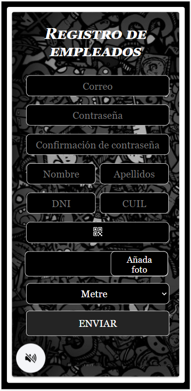<br>

<strong> Pantalla de alta mesa y esperando mesa.</strong><br>
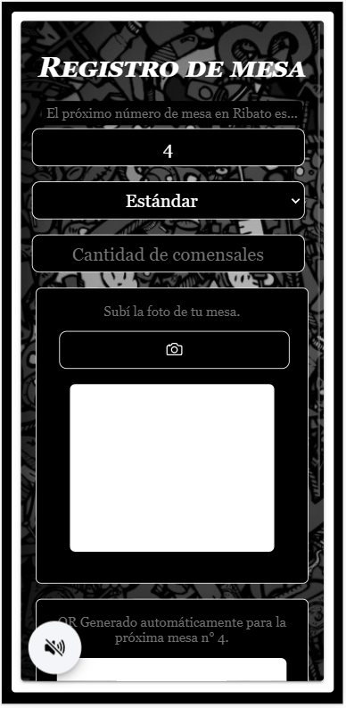
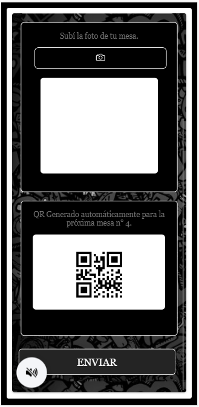

<strong> Pantalla de alta productos</strong><br>
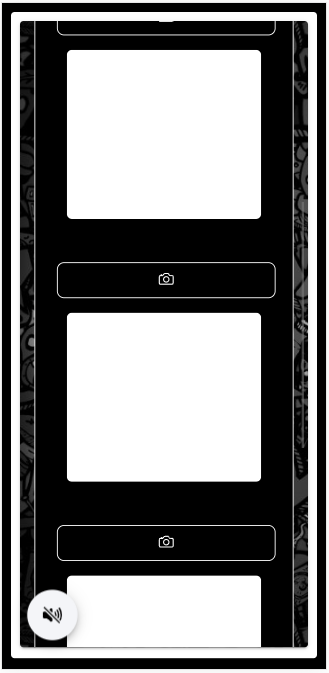
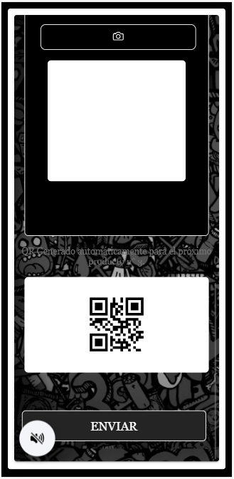
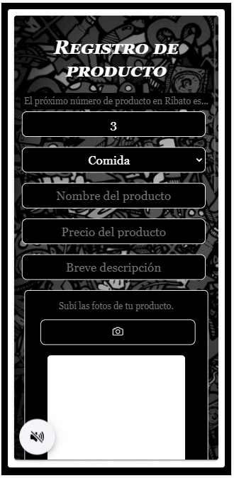<br>

***
<h3>Homes</h3>

<strong> Pantalla de home</strong><br>
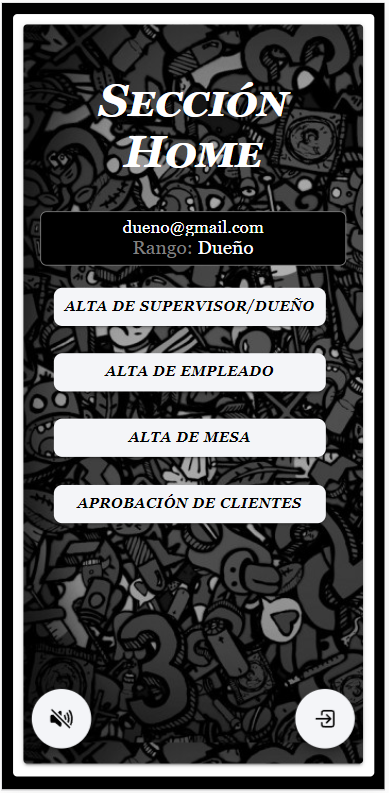

<strong> Pantalla de home mozo y de chat con los mozos.</strong><br>
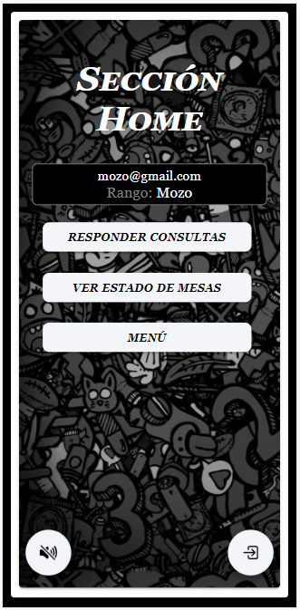
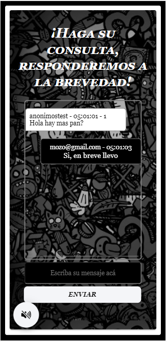<br>

<strong> Pantalla de home bartender y cocinero.</strong><br>
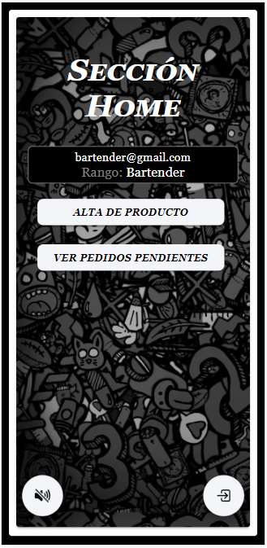
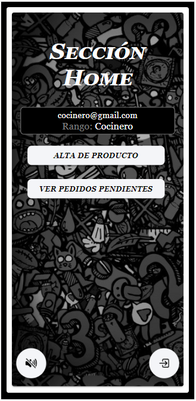<br>
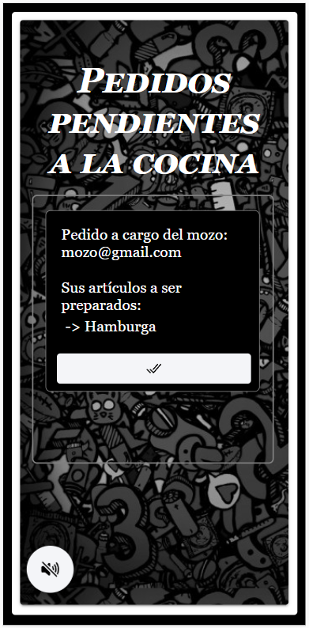<br>

***
<h3>Mail-sending</h3>

<strong> Pantalla de mail (cliente aceptado y rechazado).</strong><br>
<br>
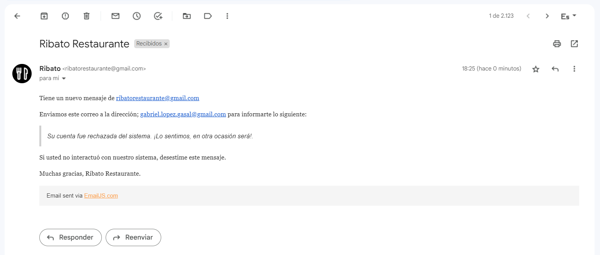<br>

***
<h3>Push notifications</h3>

<strong> Push notifications de distinto tipo.</strong><br>
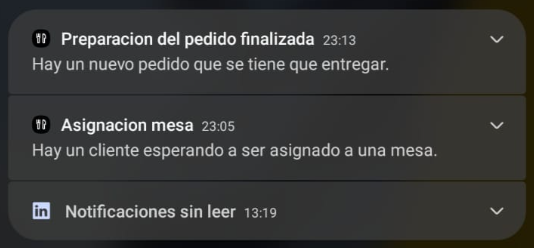
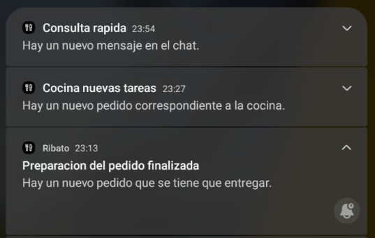<br>

***
<h3>Cuenta</h3>

<strong> Pantalla de propina y cuenta final.</strong><br>
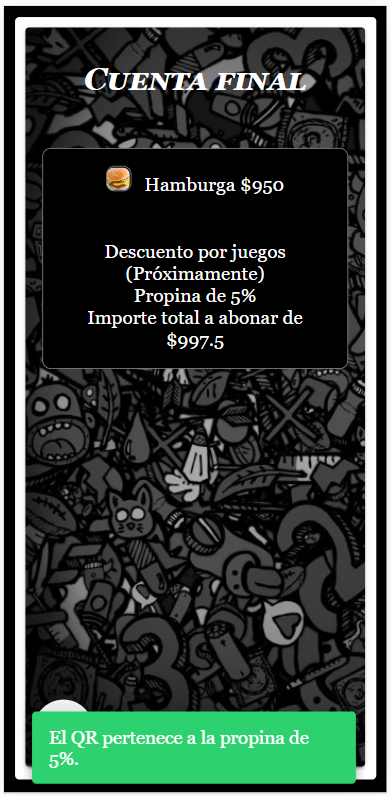
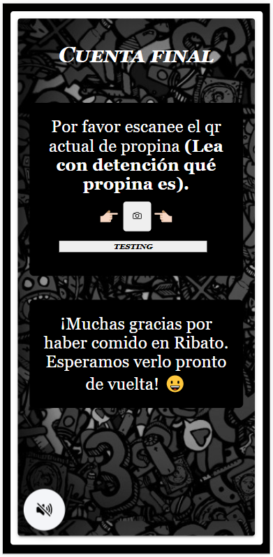<br>

***
<h3>Pedidos (gestión)</h3>

<strong> Pantalla de pedidos esperando un mozo y esperando la respuesta del mozo. Home pedido y estado del pedido</strong><br>
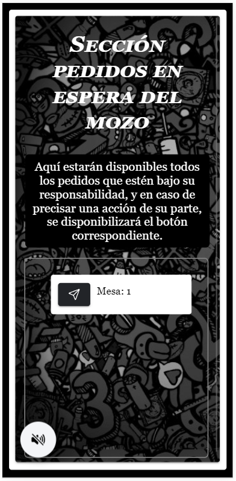
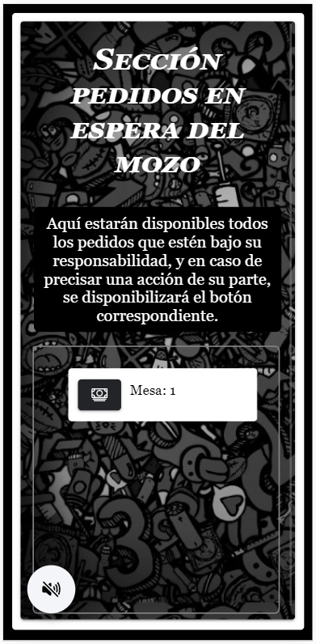<br>
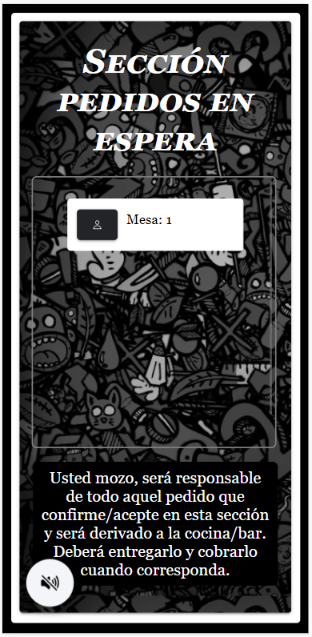
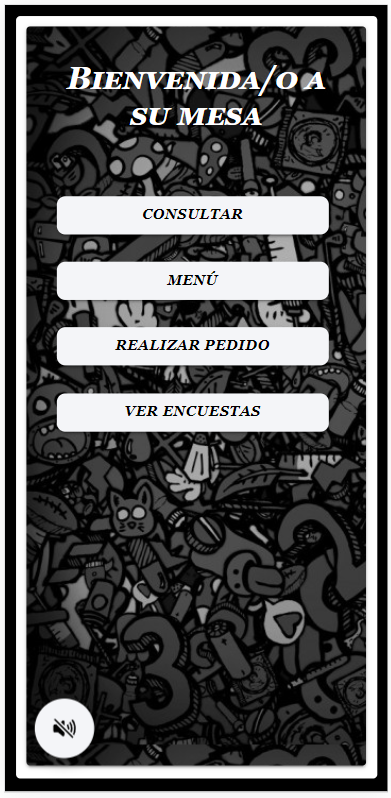<br>
<br>

***
<h3>Pantallas de interfaz (menú visual, encuestas, menú interactivo/carrito)</h3>

<strong> Pantalla de pedidos esperando un mozo y esperando la respuesta del mozo.</strong><br>

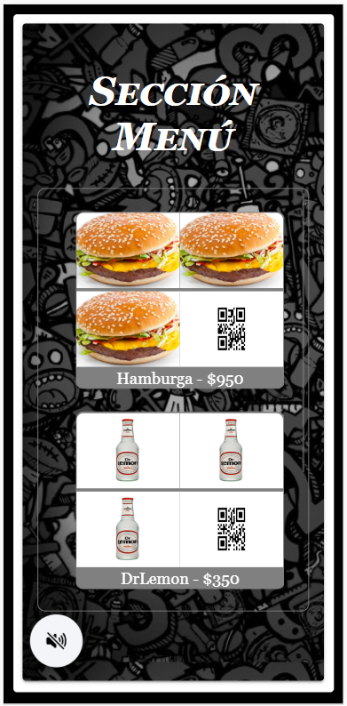<br>
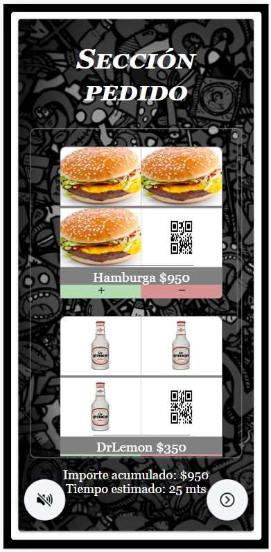<br>

***
<h3 id="comandos">👨🏻‍💻 Comandos utilizados</h3>

Actualizar la carpeta android con los archivos de Angular
```
$ ionic build
$ npx cap sync
$ npx cap open android
```

Agregar la carpeta android (Generada desde 0)
```
$ npx cap add android
```

Levantar un servidor local del proyecto
```
$ ionic serve
```
 
Crear el proyecto
```
$ ionic start Ribato blank --type=angular
$ cd Ribato
$ npm install @capacitor/core
$ npm install @capacitor/cli --save-dev
$ npm install @capacitor/android
$ npx cap init
```
 
***
<h3 id="profesores">👨🏼‍🎓 Profesores</h3>

<a href="https://github.com/agmorelli">Augusto Morelli</a> - <strong>Ayudante</strong> <br>
<a href="https://github.com/naferrero-utnfra">Nicolás Ferrero</a> - <strong>Ayudante</strong> <br>
<a href="https://github.com/maxineinerutn">Maximiliano Neiner</a> - <strong>Profesor</strong> <br>
  
***
<h3 id="objetivo">📈 Objetivo</h3>
Lograr una aplicación utilizando el hardware del dispositivo móvil para la gestión de información, enfocada en la experiencia de usuario. <br>
El enfoque va a estar dado por los usuarios de un RESTAURANT, el cual apunta todos sus esfuerzos en mejorar la utilización de su servicio por medio de una aplicación para celulares. <br>

***
<h3 id="requerimientosExcluyentes">📍 Requerimientos excluyentes</h3>

- Splash animado con ícono de la aplicación y los apellidos y nombres de los integrantes del grupo. <br>
- Todo en español. (¡TODO EN ESPAÑOL, los acentos pertenecen al idioma!). <br>
- Todo error o información mostrarlo con distintas ventanas. (DISTINTAS, ¡NO alerts!). <br>
- Sonidos distintos al iniciar y cerrar la aplicación. <br>
- Validación de datos, en todos los formularios. (TODOS LOS DATOS, EN TODOS LOS FORMULARIOS). <br>
- Spinners, con el logo de la empresa, en todas las esperas. (TODAS). <br>
- Vibraciones al detectarse un error. (TODOS LOS ERRORES). <br>
- Distintos botones de usuario para testear el ingreso (flotantes, fijos, con distintas formas y distintas posiciones). <br>
- La TOTALIDAD de la superficie de la pantalla debe estar ocupada con distintos elementos. (¡NO debe haber espacios neutros!). <br>
- Generación de distintos tipos de encuestas. <br>
- Utilización de push notification. <br>
- Envío automático de correos electrónicos (desde cuenta 'empresarial', NO desde la cuenta de un particular). <br>
- Lectura de distintos códigos Qr’s. <br>
- Implementación de distintos juegos. <br>
- Generación de documentos (JSON / EXCEL). <br>
- Cargado de datos por medio de un archivo (JSON / EXCEL). <br>
- Gráficos estadísticos (torta, barra, etc.). <br>
- Los perfiles de usuarios deben ser: <br>
   + Dueño <br>
   + Supervisor <br>
   + Empleado (tipos: metre, mozo, cocinero, bartender) <br>
   + Cliente (tipos: registrado o anónimo) <br>

***
<h3 id="requerimientosPorFecha">🗓 Requerimientos por fechas de entrega</h3>

<strong>
  Requerimientos 1era fecha (segundo parcial):
</strong> 

<br>

- Datos cargados de tres (3) semanas de operaciones (simuladas). <br>
- Todas las altas completas por integrante. <br>
- Todos los Qr completos por integrante. <br>
- Al menos siete (7) responsabilidades completas por alumno (incluyendo las tareas de gestión a definir). <br>
- Icono de la empresa.
- Splash con animación (detallando apellidos y nombres de los integrantes del grupo). <br>
- Sonidos, con posibilidad de desactivarlos desde la aplicación. <br>
- Despacho automático de correos electrónicos. <br>
- Push notification. <br>

<strong>
  Requerimientos 2da fecha (primera fecha de finales):
</strong>

<br>

- Al menos nueve (9) responsabilidades completas por alumno (incluyendo todas las tareas de gestión). <br>
- Todas las encuestas realizadas. <br>
- Login con redes sociales (Facebook, Google+, etc.). <br>

<strong>
  Requerimientos 3era fecha o posterior
</strong>

<br>

- A definir. <br>
